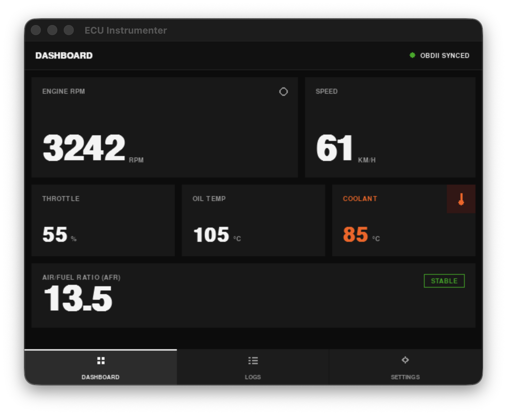

# ECU Instrumenter 

> **v1.0** — High-Performance OBD-II Dashboard for Miyoo Mini Plus

ECU Instrumenter is a lightweight telemetry dashboard designed specifically for the **Miyoo Mini Plus (OnionOS)**. Built efficiently in Python, it connects wirelessly to any standard ELM327 Wi-Fi OBD-II adapter, instantly transforming your retro handheld console into a dynamic, real-time vehicle instrument cluster!



- **Wireless OBD-II Connectivity:** Automatically polls and parses TCP ELM327 packets (RPM, Speed, Throttle, Coolant, Oil, AFR) over standard vehicle Wi-Fi hotspots.
- **Memory-Efficient Telemetry Logging:** Activate `SAVE HISTORY` to silently spool your engine's vitals into an efficient `history.log` (JSON Lines format) exactly every 5 seconds for track analysis, meticulously designed not to overflow the Miyoo's limited 128MB RAM footprint
- **Offline Demo Mode:** Demo the UI layout with smooth mathematical engine simulations—no car required!
- **Cross-Platform Compatibility:** Runs natively on both OnionOS (Python 2.7 targeting) and desktop macOS/Linux setups (Python 3 natively).

## Running Locally (macOS/Desktop) 💻

Test or run the dashboard directly on your laptop via PyGame before syncing it to your device:

1. Clone the repository and ensure Python is installed.
2. Install dependencies: 
   ```bash
   pip3 install pygame
   ```
3. Run the application via Makefile:
   ```bash
   make run
   ```
*(Pro tip: We include a `mock_server.py` daemon you can run independently alongside your game window to effortlessly simulate wave-fluctuating ELM327 vehicle data over localhost!)*

## Deploying to Miyoo Mini Plus (OnionOS) 🎮

This project automatically connects to your Miyoo Mini Plus over Wi-Fi (SSH) to aggressively sync the application files flawlessly into the SD Card.

1. Turn on your Miyoo Mini Plus and make sure it is connected to your local Wi-Fi. 
2. Deploy the files natively using the Makefile target:
   ```bash
   make deploy
   ```
   *(Note: This uses the default layout variable `192.168.1.53`. If your device receives a new IP from your router, you can update it instantly by defining: `make deploy MIYOO_IP=192.168.1.54`)*

3. Pop open your Miyoo Mini, navigate precisely to your **Apps** tab, and launch **ECU Instrumenter**!

## Architecture & Contributions 🛠️

ECU Instrumenter uses a cleanly refactored dictionary-driven polling map inside `core/obd_client.py`. To capture new ECU telemetry (like Intake Temp, MAF, etc.), simply map your standard Hex PID and translation math into the `_setup_pid_map()` method dictionary and it will automatically attach itself to your `global_state` globally for the UI cards to grab!

Contributions, forks, and PRs are fully welcome! Please run the native quality checks before making PR requests:
```bash
make check
```
