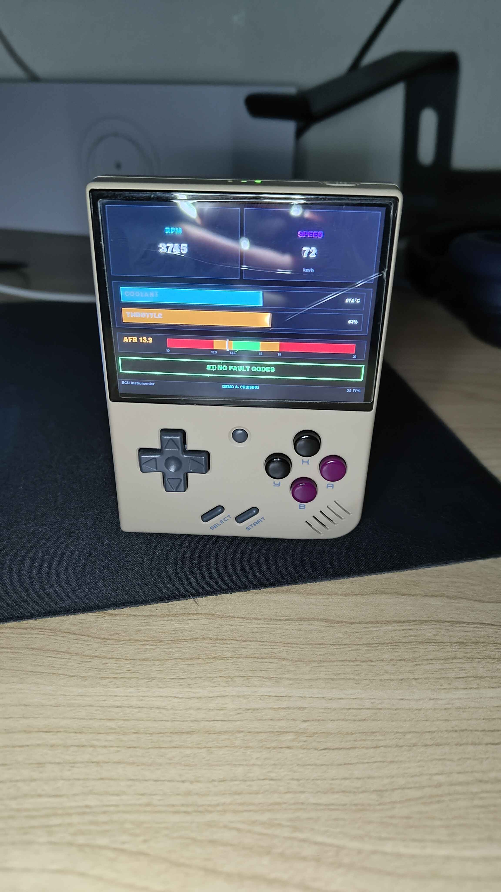

# ECU Instrumenter

> Still under development

ECU Instrumenter is a dashboard application for displaying ECU data on Miyoo Mini Plus (OnionOS).



## Features

- Display ECU data on Miyoo Mini Plus (OnionOS)
- Display ECU data on macOS

## Running Locally (macOS/Desktop)

Launch the dashboard natively using PyGame on your laptop:

1. Ensure Python 3 is installed.
2. Install pygame: `pip3 install pygame` (or `pip install pygame`)
3. Run the application via Makefile:
   ```bash
   make run
   ```

## Development Checks

Run quick quality checks before opening a PR:

```bash
make check
```

## Deploying to Miyoo Mini Plus (OnionOS)

This project connects to your Miyoo Mini Plus over Wi-Fi (SSH) to inject the application files directly into the correct SD Card folders! 

1. Turn on your Miyoo Mini Plus and connect it to your local Wi-Fi. 
2. Deploy the files natively using the Makefile target:
   ```bash
   make deploy
   ```
   *(Note: This uses the default IP `192.168.1.53`. If your device receives a new IP from your router, you can update it by running: `make deploy MIYOO_IP=192.168.1.54`)*

3. To play, simply pop open your Miyoo Mini Plus, navigate to your **Apps** tab, and launch `ECU Instrumenter`!
